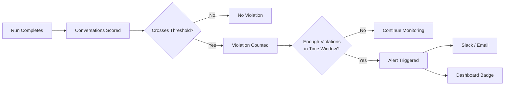

Simulation alerts notify your team when test results fall outside the quality boundaries you've set, turning simulation runs into an automated safety net that flags regressions the moment they appear.

## How Alerts Work

After a simulation run completes and conversations are scored against your Custom Metrics, Bluejay counts how many results have crossed a configured threshold within a rolling time window. The alert only fires when enough violations accumulate — so a single edge-case failure doesn't trigger noise, but a real regression does.

## Configuration

| Field | Description | Example |
|-------|-------------|---------|
| **Metric** | The Custom Metric or built-in metric to monitor | Goal Completion Rate |
| **Condition** | Whether to alert when the score is _above_ or _below_ the boundary | Below |
| **Threshold** | The numeric boundary that counts as a violation | 85% |
| **Occurrences** | How many violations must occur before the alert fires | 3 |
| **Time Window** | The rolling interval over which violations are counted | 30 minutes |

## Example: Catching Latency Regressions

An alert configured to fire when average agent latency exceeds 3 seconds at least 5 times within 30 minutes:

- A run where 2 out of 10 conversations exceed 3 seconds does **not** trigger — only 2 of the required 5 occurrences.
- A second run within the same window adds 4 more violations, reaching 6 total — the alert **fires** and your team gets notified.
- If 45 minutes pass with only 3 violations, the earlier ones roll out of the window — no alert.

For zero-tolerance metrics like hallucination detection, set occurrences to 1 so the alert fires on the first violation in testing.

## Routing to Slack

Connect Bluejay to your Slack workspace through the [Slack integration](/integrations/slack) and route alerts to specific channels:

- **Engineering** -- latency regressions, broken tool call flows, model performance drops
- **QA** -- hallucination detections, low pass rates, redundancy spikes
- **Release management** -- quality gate failures that block a deployment

## Common Configurations

| Scenario | Occurrences | Time Window |
|----------|-------------|-------------|
| Hallucination in testing | 1 | 60 min |
| Goal completion regression | 3 | 30 min |
| Latency regression | 5 | 30 min |
| Compliance failure | 1 | 60 min |
| Tool call accuracy drop | 3 | 30 min |

## Common Use Cases

- **Regression detection** -- alert when scores drop after a prompt or model change so you can investigate before shipping
- **CI/CD quality gates** -- pair alerts with [GitHub Actions](/cookbook/github-actions) for both human notification and automated PR blocking
- **Feature validation** -- set tight thresholds on feature-specific metrics when launching new agent capabilities
- **Compliance checks** -- use occurrences of 1 for regulatory metrics where any single failure must be caught

## Best Practices

- **Set strict thresholds** -- simulations run controlled scenarios, so thresholds can be tighter than production
- **Use alerts alongside CI checks** -- alerts notify humans; CI checks block merges. Use both for defense in depth
- **Create feature-specific alerts** -- dedicated alerts for new capabilities prevent regressions from hiding behind overall pass rates
- **Raise the bar over time** -- tighten thresholds as your agent improves so alerts continue to catch meaningful regressions

## Next Steps

<CardGroup cols={2}>
  <Card title="Slack Integration" icon="/logo/slack-blue.svg" href="/integrations/slack">
    Connect Bluejay to Slack for real-time alert delivery.
  </Card>
  <Card title="Custom Metrics" icon="gauge-high" href="/key-concepts/custom-metrics/overview">
    Define the metrics that power your alert thresholds.
  </Card>
  <Card title="Simulation Dashboards" icon="table-columns" href="/test/simulations/dashboards">
    Visualize simulation trends alongside your alerts.
  </Card>
  <Card title="GitHub Actions" icon="code-branch" href="/cookbook/github-actions">
    Automate simulation runs and quality gates in CI.
  </Card>
</CardGroup>
