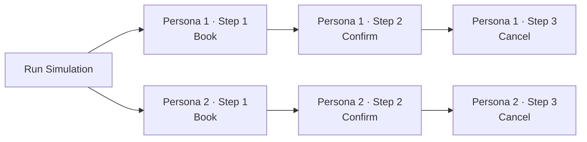

Real customers rarely call once. They book, then call back to confirm, then call again to cancel or reschedule. A simulation that only models a single call misses the bug that only shows up on the *second* call — the one where the agent should already know who the customer is.

**Customer Journeys** is a Bluejay simulation type that runs a fixed sequence of calls through a single Digital Human. Identity (name, phone, persona, traits) stays locked across every call in the sequence. The next call kicks off as the previous one completes, so you can stress-test how your agent handles repeat-customer state, hand-offs between flows, and follow-up logic.

{/* SCREENSHOT — Create Simulation modal with the Customer Journeys card highlighted in the type grid. */}

## When to Reach for a Journey

| You want to test… | Use a Journey |
|---|---|
| Booking → confirmation → cancellation across the same customer | ✅ |
| Onboarding follow-ups (call 1: sign up, call 2: verify, call 3: activate) | ✅ |
| Whether the agent remembers prior context on a repeat call | ✅ |
| Repeat-customer recognition (phone-number lookups, account hydration) | ✅ |
| A single isolated call | Use a regular Voice / Text simulation instead |

## Anatomy of a Journey

A journey is two things:

1. **An ordered list of steps.** Each step has an **Intent** (what the customer is trying to do) and a **Success criteria** (what counts as the agent doing it right).
2. **A journey count.** How many Digital Humans run that sequence in parallel. 1 journey = 1 unique persona running every step. 10 journeys = 10 unique personas, each running the full sequence.

Total conversations = `journey count × step count`. A 3-step journey run by 10 personas places 30 calls.

## Configuring a Journey

### 1. Pick the Customer Journeys Card

1. Go to **Simulations** → **Create Simulation** → pick your agent
2. Scroll the type grid and pick the **Customer Journeys** card (footprints icon)

### 2. Define the Steps

In the left pane, click **Add step** for each call the persona will make. Each step takes a short **Step title** (e.g. `Book appointment`). Drag the handle to reorder, click the × to remove.

The right pane animates a live preview of the journey — one step `done`, one `on call`, the rest `queued` — so you can sanity-check the order before kicking off. You'll get a chance to add richer **Intent** and **Success criteria** per step on the persona review screen after generation.

{/* SCREENSHOT — Customer Journeys split-view config: journey-step list on the left, animated Digital Human sequence preview on the right. */}

### 3. Set the Journey Count

The right side of the footer has a stepper. Pick how many Digital Humans should run the full sequence. Bluejay shows the math live:

> `10 × 3 steps = 30 conversations`

Allowed range: **1–200 journeys** per simulation.

### 4. Review the Personas

Click **Generate Digital Humans** and Bluejay creates one persona per journey. Each persona renders as a **Customer Journey card** showing every step in order with the step number, Intent, and Success criteria stacked in a connected timeline.

{/* SCREENSHOT — Persona review screen: Sarah Johnson (3-step) and Marcus Chen (2-step) journey cards side-by-side, each step showing Intent + Success criteria. */}

Hit the pencil to enter edit mode and:

- Tweak any step's **Intent** and **Success criteria** inline
- Drag steps to reorder (the number circle is the drag handle)
- Add new steps with the `+` button
- Remove a step with the `×` (disabled when only one step remains)

<Tip>
  Editing the steps on one persona scopes to *that* persona only. Different personas can run slightly different journeys — useful for A/B variants.
</Tip>

## Running a Journey

Hit **Run Simulation** and Bluejay queues every conversation. Concurrency rules:

- All journeys run in parallel up to your simulation's **max concurrent conversations** limit
- Within a single journey, calls run **strictly sequentially** — step 2 will not start until step 1 reaches a terminal state
- Identity is locked: the same `name`, `phone`, `email`, and persona context flow into every call in the journey

## Running the Simulation and Seeing Each Step

Hit **Run Simulation** and Bluejay queues every call. The Runs page collapses each persona's calls into a single row — click the arrow to expand and watch every step play out in order. Each step is labelled with its intent (e.g. `↳ Step 1 · Say hi to Ronniel`) so you can follow a persona through the whole journey at a glance.

Steps run strictly in order. Step 2 stays in `Initializing` until Step 1 finishes — Bluejay never skips ahead, so you'll see the journey unfold one call at a time.

{/* SCREENSHOT — Runs page with two journey personas expanded (Sarah Johnson · 3 runs and Marcus Chen · 2 runs), each step labelled with its intent and showing Running/Initializing status. */}

## Next Steps

<CardGroup cols={2}>
  <Card title="Simulation Overview" icon="flask-vial" href="/test/simulations/overview">
    How simulations work in Bluejay end-to-end.
  </Card>
  <Card title="Simulation Types" icon="shapes" href="/test/simulations/types">
    Voice, text, regression — pick the right category.
  </Card>
  <Card title="Digital Humans" icon="user" href="/key-concepts/digital-humans/overview">
    Configure the personas that run your journeys.
  </Card>
  <Card title="Simulation Results" icon="chart-mixed" href="/core-concepts/simulation-results">
    Interpret journey results and compare across runs.
  </Card>
</CardGroup>
