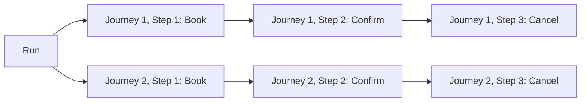

Customer Journeys is a simulation type where one Digital Human calls your agent several times in a fixed order. The name, phone, email, and traits stay the same on each call. Use it to test repeat-customer logic, such as recognition by phone number or a follow-up on an earlier booking.

<iframe
  src="https://www.youtube.com/embed/MywLdzH9J3g"
  width="100%"
  height="450"
  frameBorder="0"
  allowFullScreen
  style={{ borderRadius: '0.5rem' }}
></iframe>

## Create a journey

1. Open the **Simulations** page, select the agent, and click **Create**.
2. Select **Customer Journeys**.
3. Click **Add step** for each call. For each step, enter the intent, for example "Book appointment". Optionally enter success criteria. If you leave it blank, Bluejay writes it.
4. Drag a step to change the order.
5. Set the number of journeys with the stepper. The range is 1 to 200.
6. Generate the Digital Humans. Each Digital Human shows its steps in order with the intent and success criteria.
7. Optional: click the pencil on a Digital Human to edit, add, remove, or reorder its steps. The change applies to that Digital Human only.
8. Run the simulation.

Total calls = journeys × steps. For example, 10 journeys with 3 steps place 30 calls.

## How a journey runs

- Journeys run in parallel, up to the simulation's concurrency limit.
- In one journey, the steps run in order. A step stays `INITIALIZING` until the step before it ends.
- If a step ends as `NO_CONNECTION`, `NO_ANSWER`, `CALL_DROPPED`, `OUT_OF_FUNDS`, or `SYSTEM_ERROR`, Bluejay cancels the next steps with `STEP_SKIPPED`. A step that ends as `COMPLETED`, `CONVERSATION_ENDED`, or `CUSTOM_ERROR` does not skip the next step.

```mermaid
flowchart LR
    Q["Run"] --> P1["Journey 1, Step 1: Book"]
    Q --> P2["Journey 2, Step 1: Book"]
    P1 --> P1b["Journey 1, Step 2: Confirm"]
    P1b --> P1c["Journey 1, Step 3: Cancel"]
    P2 --> P2b["Journey 2, Step 2: Confirm"]
    P2b --> P2c["Journey 2, Step 3: Cancel"]
```

## Results

On the run page, the calls of one journey group into one row. Expand the row to see each step, labeled with its number and intent. For statuses, see [Simulation Results](/test/simulations/simulation-results#call-statuses).

