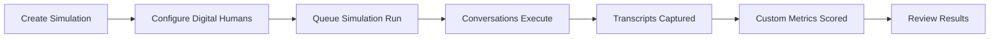

Simulations are controlled evaluation runs that let you test your agent against realistic customer scenarios before those scenarios happen in production. They are designed to be repeatable, measurable, and easy to compare over time.

## What You'll Learn

- How to create and configure a simulation
- How the simulation lifecycle works end to end
- How to review results and iterate on your agent

## How Simulations Work

Use Simulations to exercise an Agent with Digital Humans, edge cases, and targeted goals so your team can catch failures early and ship with more confidence.

Each Simulation contains a set of Digital Humans that interact with your Agent through the integration channel you configure (telephony, SIP, LiveKit, WebSocket, or HTTP). When a run completes, every conversation is evaluated against your Custom Metrics and the results are available in your dashboard and via the API.

## Running a Simulation

<Tabs>
  <Tab title="Dashboard">
    1. Navigate to **Agents & Simulations** in the sidebar
    2. Select your Agent and click **Create new simulation**
    3. Add Digital Humans with scenarios and success criteria
    4. Click **Create and start** to queue the run
    5. Review results in the simulation detail view
  </Tab>
  <Tab title="API">
    1. [Add your agent](/api-reference/endpoint/add-agent) to Bluejay if you haven't already
    2. [Create a simulation](/api-reference/endpoint/create-simulation) to group your Digital Humans so you can run them in parallel
    3. [Generate](/api-reference/endpoint/generate-digital-humans) or [Create](/api-reference/endpoint/create-digital-human) Digital Humans — make sure to attach the Simulation ID so they are associated with the Simulation you created in Step 2
    4. [Queue a simulation run](/api-reference/endpoint/queue-simulation-run) to trigger the simulation — think of this as the Run button
  </Tab>
</Tabs>

## Next Steps

<CardGroup cols={2}>
  <Card title="Simulation Types" icon="shapes" href="/test/simulations/types">
    Understand voice, text, and regression simulation categories.
  </Card>
  <Card title="Simulations Deep Dive" icon="book" href="/core-concepts/simulations">
    Full reference for simulation configuration and execution.
  </Card>
  <Card title="Simulation Runs" icon="play" href="/core-concepts/simulation-runs">
    Learn about run lifecycle, statuses, and result retrieval.
  </Card>
</CardGroup>
