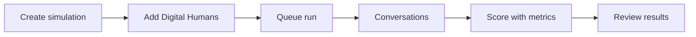

A simulation is a set of Digital Humans that you run against one agent. Each run places one Conversation for each Digital Human and scores it against your success criteria and Custom Metrics.

```mermaid
flowchart LR
    Create[Create simulation] --> DH[Add Digital Humans]
    DH --> Run[Queue run]
    Run --> Conv[Conversations]
    Conv --> Score[Score with metrics]
    Score --> Review[Review results]
```

## Run a simulation

<Tabs>
  <Tab title="Dashboard">
    1. Open the **Simulations** page.
    2. Select the agent and click **Create**. The **Create Simulation** dialog opens.
    3. Select a [simulation type](#simulation-types) and complete its settings.
    4. Click **Generate N Digital Humans**.
    5. Review the Digital Humans. To start the run, click **Run N Calls**. To keep them without a run, click **Save for later**.
    6. Read the results on the run page. See [Simulation Results](/test/simulations/simulation-results).

    If the agent has no connection type, **Create** is not available. Set one in **Connection Settings** first.
  </Tab>
  <Tab title="API">
    1. [Add your agent](/api-reference/endpoint/add-agent).
    2. [Create a simulation](/api-reference/endpoint/create-simulation).
    3. [Generate](/api-reference/endpoint/generate-digital-humans) or [create](/api-reference/endpoint/create-digital-human) Digital Humans. Include the simulation ID.
    4. [Queue a simulation run](/api-reference/endpoint/queue-simulation-run).
  </Tab>
</Tabs>

<video controls muted playsInline preload="metadata" className="w-full rounded-xl" src="/videos/create-simulation-dialog.mp4"></video>

## Simulation types

The type sets how Bluejay makes the Digital Humans.

| Type | What it does |
|---|---|
| Generate from Natural Language | Makes Digital Humans from a plain-language description. |
| Goal Adherence | Tests how well the agent reaches the goals you set. |
| Replay From Transcript | Makes Digital Humans from existing Conversations. |
| Generate From Workflow | Makes one Digital Human for each path through the agent's synced multi-agent Workflow. |
| Customer Journeys | One Digital Human calls the agent several times in sequence. See [Customer Journeys](/test/simulations/customer-journeys). |
| Upload Digital Humans | Makes Digital Humans from a CSV file. |
| Use Previous Digital Humans | Uses existing Digital Humans or communities. |
| Load Testing | Tests performance, latency, and throughput under load. |
| Voicemail | Acts as a voicemail machine: plays a greeting, then records the message. |
| IVR Flow | Plays an IVR Flow from the [Scenario Builder](/key-concepts/scenario-builder/overview). Your agent is the caller. Voice agents only. |
| Scenario Adherence | Makes one Digital Human for each path through a [scenario](/key-concepts/scenario-builder/overview). Voice agents only. |
| Generate from Knowledge Base | Makes Digital Humans across the topics in a [Knowledge Base](/key-concepts/knowledge-base/overview). |
| Generate from System Prompt | Finds each rule in the agent prompt and makes Digital Humans to test them. |

Red Teaming runs start from the **Red Teaming** page. See [Red Teaming](/key-concepts/red-teaming/overview).

## Channels

The agent connection sets the channel.

| Channel | Connections |
|---|---|
| Voice | [SIP and telephony](/simulation-integrations/sip), [LiveKit](/integrations/livekit), and provider integrations such as [Vapi](/integrations/vapi) and [Retell](/integrations/retell) |
| Text | [HTTP Webhooks](/simulation-integrations/http-webhooks), [WebSockets](/simulation-integrations/websockets), SMS |
| Email | [Email agents](/key-concepts/agents/overview) send and reply to real email. |

<video controls muted playsInline preload="metadata" className="w-full rounded-xl" src="/videos/email-run-sim.mp4"></video>
