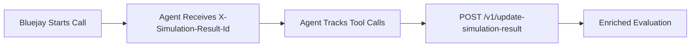

Bluejay can ingest the tool calls and metadata your voice agent produces during simulations, giving you evaluation data that goes far beyond transcript analysis. By capturing every API call, database query, and business action your agent takes, you can measure whether it performed the right operations — not just whether it said the right things.

## How It Works

During a simulation, Bluejay provides a unique `X-Simulation-Result-Id` for each conversation. Your agent must extract this ID, track its tool calls and metadata during the call, and then send that data back to Bluejay post-call via the [`/v1/update-simulation-result`](/api-reference/endpoint/update-simulation-result) endpoint.



## Integration Methods

Bluejay supports two methods for passing the `X-Simulation-Result-Id` to your agent, depending on your infrastructure.

### SIP Integration (Recommended for Phone Systems)

**Best for**: traditional phone systems (PSTN), VoIP providers, and telephony infrastructure.

When Bluejay initiates calls via SIP, it injects custom headers including `X-Simulation-Result-Id` directly into the SIP INVITE message.

**Flow:**
1. Bluejay sends a SIP INVITE with custom headers to your agent
2. Your agent must extract `X-Simulation-Result-Id` from the SIP headers
3. During the call, your agent must log every tool call and relevant metadata
4. After the call ends, you must send the collected data to [`/v1/update-simulation-result`](/api-reference/endpoint/update-simulation-result)

[SIP Integration Guide →](/simulation-integrations/sip)

### WebSocket Integration

**Best for**: modern web-based agents and non-phone-based systems.

WebSocket integration using the CHIRP protocol provides real-time, bidirectional communication. The `X-Simulation-Result-Id` is passed in the WebSocket connect message.

**Flow:**
1. Bluejay establishes a WebSocket connection and passes `X-Simulation-Result-Id` in the connect message
2. Real-time CHIRP message exchange during the conversation
3. Your agent must log tool calls and metadata throughout the session
4. After the call ends, you must send the collected data to [`/v1/update-simulation-result`](/api-reference/endpoint/update-simulation-result)

[WebSocket Integration Guide →](/simulation-integrations/websockets)

### Why SIP for Phone-Based Agents?

If your agent runs through traditional phone systems (PSTN), basic telephony integration does **not** support tool call enrichment. To unlock tool call and metadata tracking for phone-based agents, you need SIP.

| Feature | Basic Telephony | SIP Integration |
|---------|----------------|-----------------|
| **Setup Complexity** | Simple phone number | SIP endpoint configuration |
| **Tool Call Tracking** | ❌ Not supported | ✅ Complete tracking |
| **Custom Metadata** | ❌ Not supported | ✅ Rich metadata support |
| **Evaluations** | Conversation-focused | ✅ Comprehensive insights |
| **Integration Effort** | Minimal | Moderate (one-time setup) |

**Compatible phone systems**: traditional PBX, VoIP providers (Twilio, RingCentral, Telnyx, etc.), and any SIP-based platform.

## Step-by-Step Guide

### 1. Choose Your Integration Method

- **Phone-based agents** → follow the [SIP Integration Guide](/simulation-integrations/sip)
- **Web-based agents** → follow the [WebSocket Integration Guide](/simulation-integrations/websockets)

### 2. Track Tool Calls in Your Agent

Implement tool call tracking wherever your agent invokes external tools, APIs, or business logic during a call:

```python
def track_tool_call(tool_name, parameters, result, timestamp):
    return {
        "tool_name": tool_name,
        "parameters": parameters,
        "result": result,
        "timestamp": timestamp
    }
```

### 3. Send Data to Bluejay

After the call ends, use the `X-Simulation-Result-Id` to call the [`/v1/update-simulation-result`](/api-reference/endpoint/update-simulation-result) endpoint with the tool calls, events, and metadata you collected.

**Endpoint:** `POST /v1/update-simulation-result`

**Headers:**
- `X-API-Key: <your-api-key>`
- `Content-Type: application/json`

**Request body:**

```json
{
  "simulation_result_id": "1234",
  "events": [
    {
      "event_type": "tool_call",
      "timestamp": "2024-01-15T10:30:00Z",
      "data": {
        "tool_name": "get_account_balance",
        "parameters": {"account_id": "12345"},
        "result": {"balance": 1500.00}
      }
    }
  ],
  "tool_calls": [
    {
      "tool_name": "transfer_funds",
      "parameters": {"from": "12345", "to": "67890", "amount": 500},
      "result": {"transaction_id": "txn_abc123", "status": "completed"},
      "timestamp": "2024-01-15T10:32:00Z"
    }
  ],
  "metadata": {
    "call_duration": 180,
    "customer_satisfaction": 5,
    "resolution_status": "resolved",
    "custom_tags": ["account_inquiry", "funds_transfer"]
  }
}
```

<Tip>
  Process tool calls and metadata asynchronously and call the endpoint **after** the call has ended. This avoids adding latency to the live conversation and ensures Bluejay can use the data during evaluation.
</Tip>

## Use Cases

### Multi-Agent Orchestration

Track tool calls across agent handoffs and escalation workflows:

```json
{
  "tool_calls": [
    {
      "tool_name": "route_to_specialist",
      "parameters": {"customer_issue": "billing_inquiry", "current_agent": "tier1_support"},
      "result": {"routed_to": "billing_specialist", "agent_id": "agent_billing_001"},
      "timestamp": "2024-01-15T10:30:00Z"
    }
  ],
  "metadata": {
    "workflow_type": "escalation",
    "total_agents_involved": 2,
    "handoff_duration_seconds": 15
  }
}
```

### Financial Services

Monitor critical financial operations with audit trails:

```json
{
  "tool_calls": [
    {
      "tool_name": "verify_account_ownership",
      "parameters": {"account_id": "12345", "verification_method": "voice_biometric"},
      "result": {"verified": true, "confidence_score": 0.95},
      "timestamp": "2024-01-15T10:30:00Z"
    },
    {
      "tool_name": "initiate_wire_transfer",
      "parameters": {"from_account": "12345", "to_account": "67890", "amount": 1000.00},
      "result": {"transaction_id": "wire_xyz789", "status": "pending_approval"},
      "timestamp": "2024-01-15T10:31:00Z"
    }
  ],
  "metadata": {
    "compliance_flags": ["high_value_transaction", "cross_border"],
    "risk_score": 0.3,
    "authentication_methods": ["voice_biometric", "account_verification"]
  }
}
```

### E-commerce & Order Management

Track customer service interactions with order processing systems:

```json
{
  "tool_calls": [
    {
      "tool_name": "lookup_order",
      "parameters": {"order_id": "ORD-2024-001"},
      "result": {"order_status": "shipped", "tracking_number": "1Z999AA1234567890"},
      "timestamp": "2024-01-15T14:20:00Z"
    },
    {
      "tool_name": "initiate_return",
      "parameters": {"order_id": "ORD-2024-001", "reason": "size_issue"},
      "result": {"return_id": "RET-2024-456", "prepaid_label": true},
      "timestamp": "2024-01-15T14:21:00Z"
    }
  ],
  "metadata": {
    "customer_tier": "premium",
    "order_value": 299.99,
    "resolution_time_seconds": 120
  }
}
```

## Best Practices

- **Capture everything** — track all external interactions, including failed calls, for complete visibility
- **Include timing** — record execution timestamps so Bluejay can correlate tool calls with conversation moments
- **Log errors** — failed tool calls and error details are just as valuable as successes for debugging agent behavior
- **Store parameters** — input parameters enable reproducibility analysis across simulation runs
- **Process async, send post-call** — handle tracking asynchronously during the call, then batch-send to [`/v1/update-simulation-result`](/api-reference/endpoint/update-simulation-result) after the call ends

## Next Steps

<CardGroup cols={2}>
  <Card title="Update Simulation Result API" icon="code" href="/api-reference/endpoint/update-simulation-result">
    Full endpoint reference for enriching simulation results.
  </Card>
  <Card title="SIP Integration" icon="phone-volume" href="/simulation-integrations/sip">
    Set up SIP connectivity for phone-based agents.
  </Card>
  <Card title="WebSocket Integration" icon="tower-broadcast" href="/simulation-integrations/websockets">
    Connect web-based agents via CHIRP protocol.
  </Card>
  <Card title="Tool Calls" icon="eye" href="/monitor/observability/tool-calls">
    Pass tool calls for production call evaluations instead.
  </Card>
</CardGroup>
