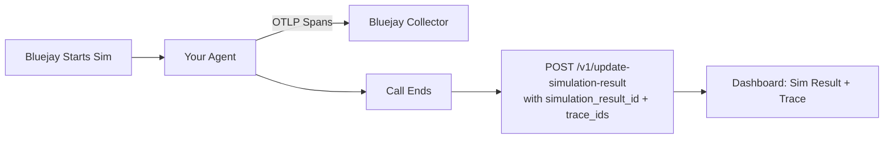

Link OTLP traces to simulation results so the trace flamegraph appears alongside the simulation evaluation in the Bluejay dashboard.



## How It Works

1. **Instrument your agent** to export OTLP traces to Bluejay — see [Sending Traces to Bluejay](/core-concepts/traces/overview).
2. **Collect trace IDs** generated during the simulation call.
3. **Extract the `simulation_result_id`** — Bluejay injects `X-Simulation-Result-Id` into every simulation call via SIP headers, WebSocket connect messages, or LiveKit participant attributes.
4. **POST to [`/v1/update-simulation-result`](/api-reference/endpoint/update-simulation-result)** with both `simulation_result_id` and `trace_ids` after the call ends.

```python
import httpx

async def link_traces_to_simulation(simulation_result_id, trace_ids, api_key):
    async with httpx.AsyncClient(timeout=10) as client:
        await client.post(
            "https://api.getbluejay.ai/v1/update-simulation-result",
            json={
                "simulation_result_id": simulation_result_id,
                "trace_ids": trace_ids,
            },
            headers={"X-API-Key": api_key},
        )
```

<Tip>
  Call `tracer_provider.force_flush()` before POSTing trace IDs. If you POST before the spans have been exported, the traces may not be available in Bluejay yet.
</Tip>

<Note>
  The [`/v1/update-simulation-result`](/api-reference/endpoint/update-simulation-result) endpoint also accepts `tool_calls`, `events`, and `metadata` alongside `trace_ids`. See [Simulation Tool Calls](/test/simulations/tool-calls) for details.
</Note>

<CardGroup cols={2}>
  <Card title="Update Simulation Result" icon="flask-vial" href="/api-reference/endpoint/update-simulation-result">
    Full endpoint reference.
  </Card>
  <Card title="Simulation Tool Calls" icon="wrench" href="/test/simulations/tool-calls">
    Enrich simulation results with tool call data.
  </Card>
  <Card title="LiveKit Traces" icon="/logo/livekit.svg" href="/simulation-integrations/livekit#sending-traces-to-bluejay">
    LiveKit-specific trace linking guide.
  </Card>
  <Card title="Sending Traces to Bluejay" icon="route" href="/core-concepts/traces/overview">
    OTLP setup and instrumentation.
  </Card>
</CardGroup>
